# ITE IT51XXX Setup Guide
Setup guide for running the secure EC PoC on an [ITE IT51XXX evb](https://docs.zephyrproject.org/latest/boards/ite/it51xxx_evb/doc/index.html).

## Connect TMP117 sensor
- Locate the GND, 3.3V, SDA, and SCL pins on the sensor IC.
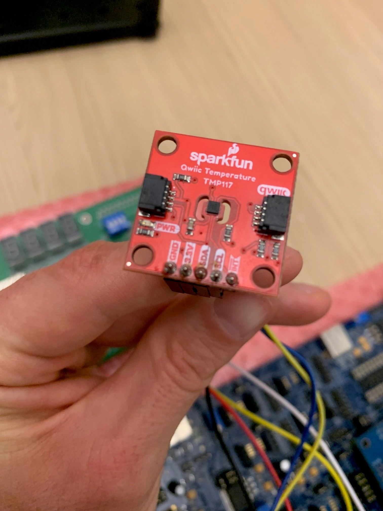

- Connect wires to them (color doesn't matter just make sure it's consistent with other images). Here we are using GND->Black, 3.3V->Red, SDA->Blue, SCL->Yellow.
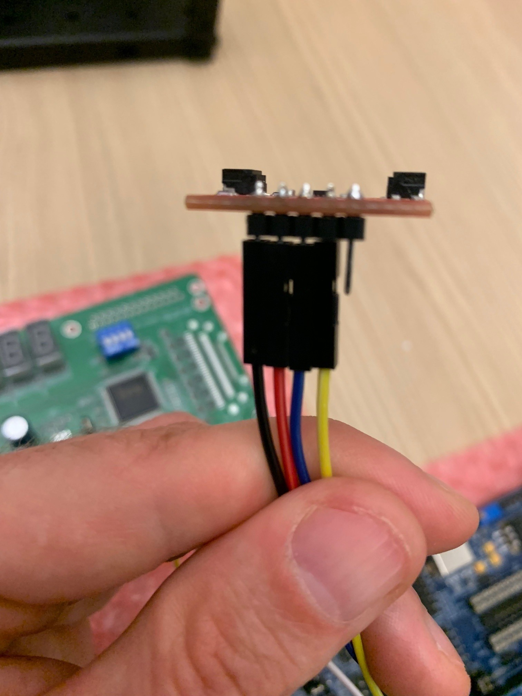

- Connect the wires to the EVB U16/SMBUS-0 connectors. Notice GND is on pin 4 of the left header and 3.3V, SCL, and SDA are on the right header at pins 1, 3, and 4 respectively. Also hard to tell in the picture, but right behind the red wire is a 3 pin header, make sure a jumper connects the left-most pin (3V) and the center pin there if not already.
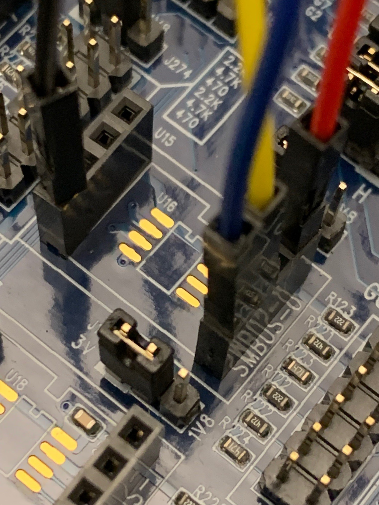

## Connect Fan (Any 5v, 4-wire fan)
- In this image we have 5V->Red/Violet, GND->Black, TACH->Yellow, PWM->Blue.
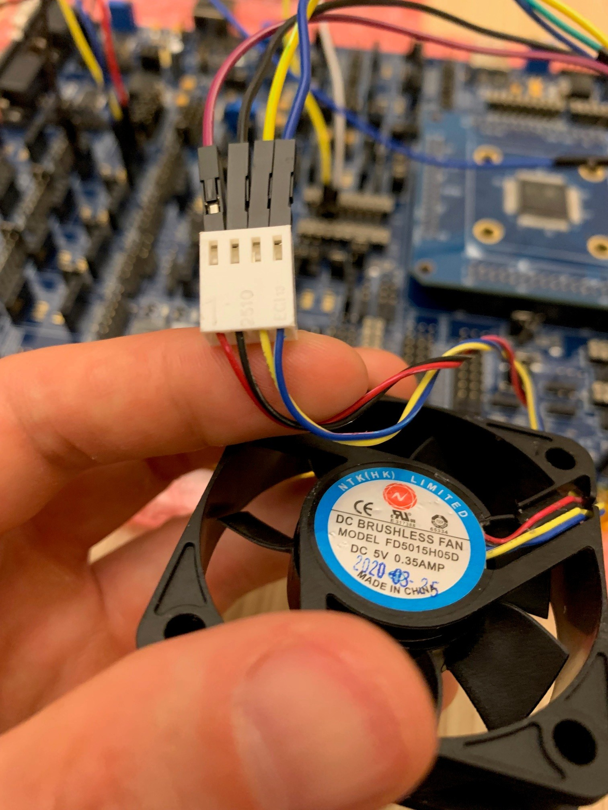

- Connect PWM (Blue) to the right-most pin on the A row of the J33 header.
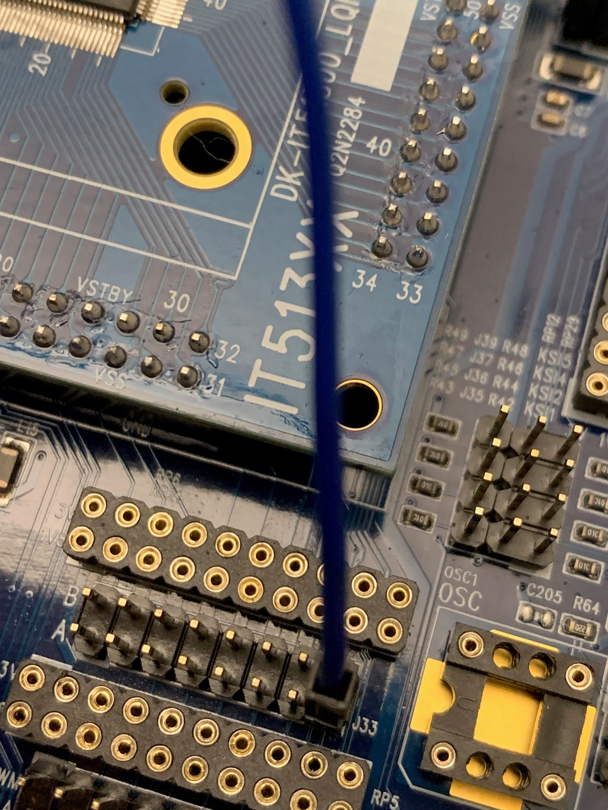

- Connect 5V (Red/Violet) to the left-most pin on the J47 header. Also ensure a jumper connects the center-pin and the right-most pin on the same header (this sets the TACH pull-up).
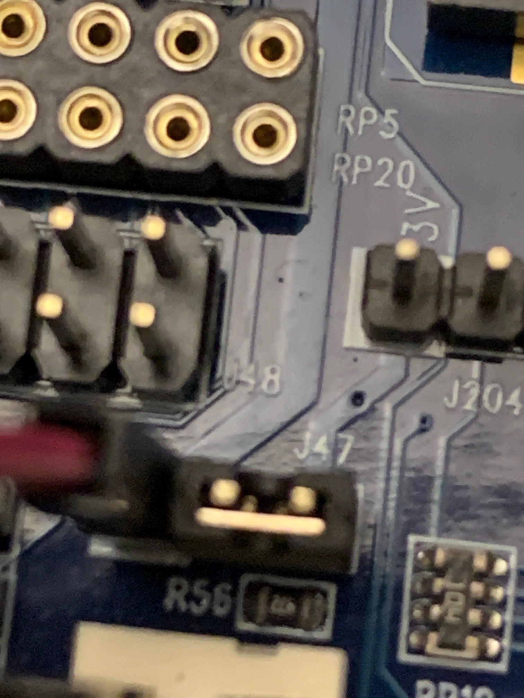

- On the J46 header, connect GND (Black) to the left-most pin and TACH (Yellow) to the right-most pin.
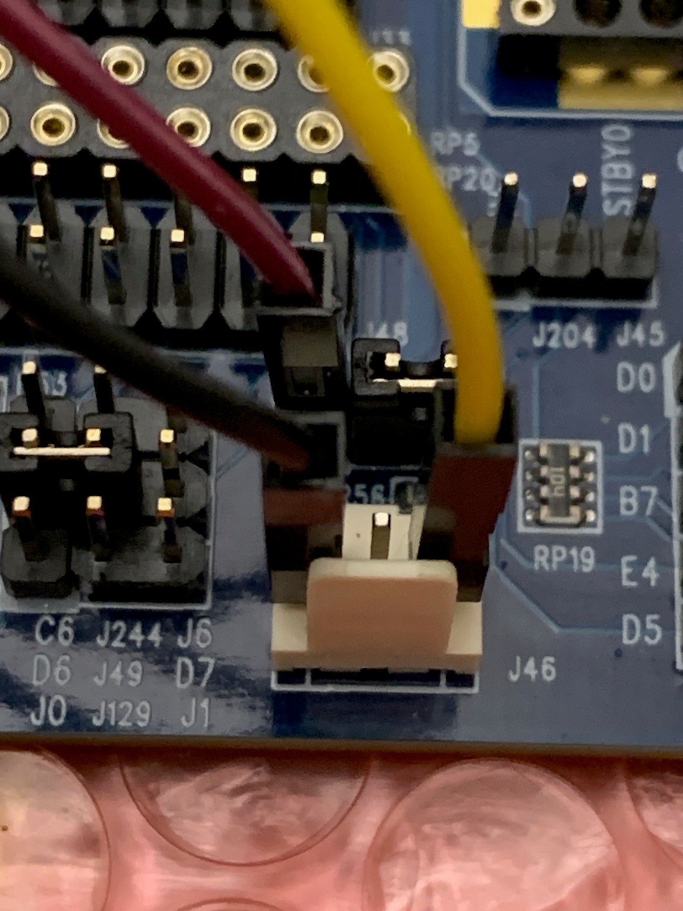

- On the J49 header (the vertically centered 3 pin header inbetween 2 other headers), add a jumper to connect the left-most pin (TACH0A) to the centeer pin.
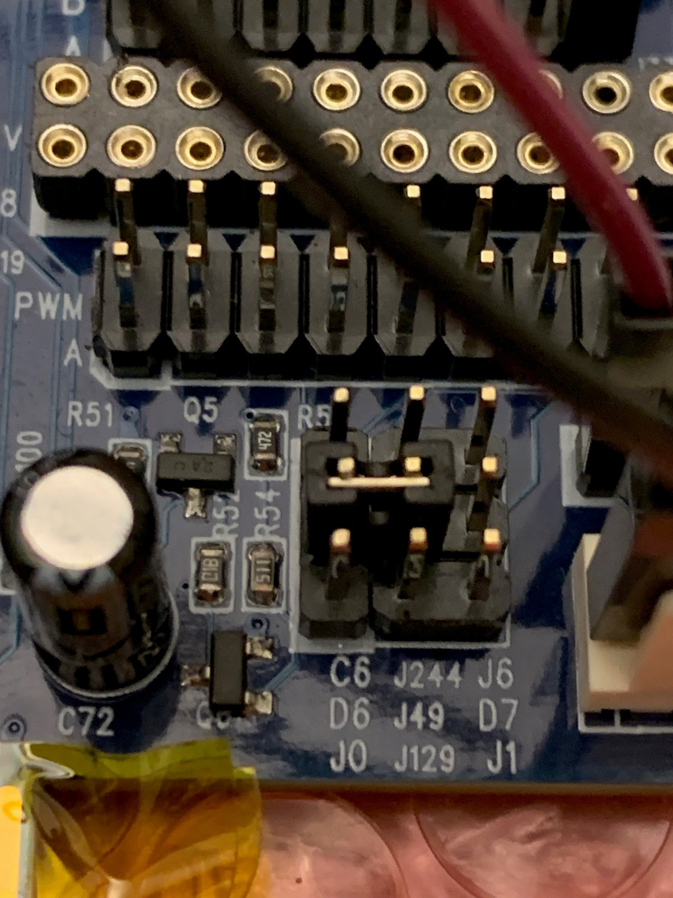

# Connecting Debug Daughter Board
This board is needed for flashing the main EVB. It is connected to (and powered by) main PC via a USB-B cable.

- Locate J5 header on the debug board and connect SCL (Yellow) to pin 2 and SDA (White) to pin 3. If the debug board does not share the same power source as the eval board, ensure you connect GND from pin 4 to a GND pin on the eval board (so they share a common ground).
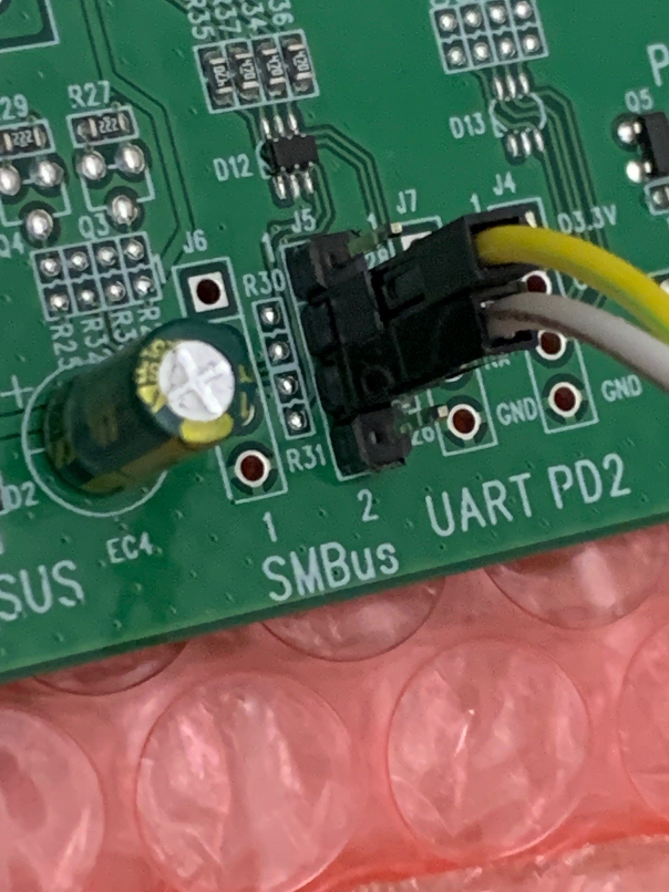

- Locate J38 header on the eval board and connect SCL to pin 2 on the C row and SDA to pin 3 on the C row. As mentioned above, if the EVB does not share the same power source as debug board, ensure you connect the GND from the debug board to a GND pin on the eval board during this step as well.
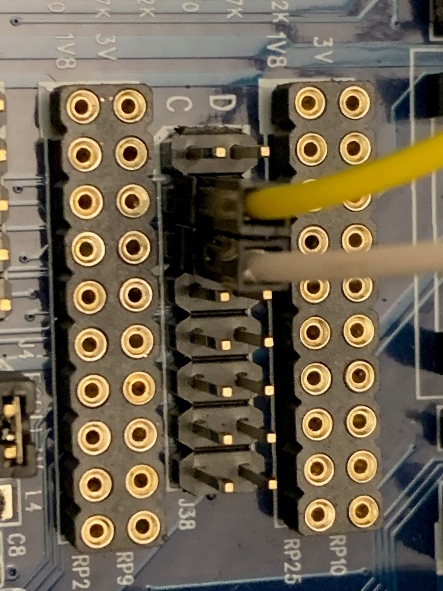

# EVB Power/UART
The EVB can be powered via 5V barrel jack supply, USB-B, or directly via jumper wires. I did not have a 5V barrel jack supply or an extra USB-B cable, so I used my USB-to-UART conenctor both to power the board and for UART comms. If you have an actual power supply that would be preferred (so you can use the power switch), but regardless you will need a USB-to-UART connector for comms.

- This is the UART-to-USB connector I am using (for power and comms). 5V->Red, GND->Black, RX->Blue (which will connect to TX on the EVB), TX->Green (which will connect to RX on the EVB).
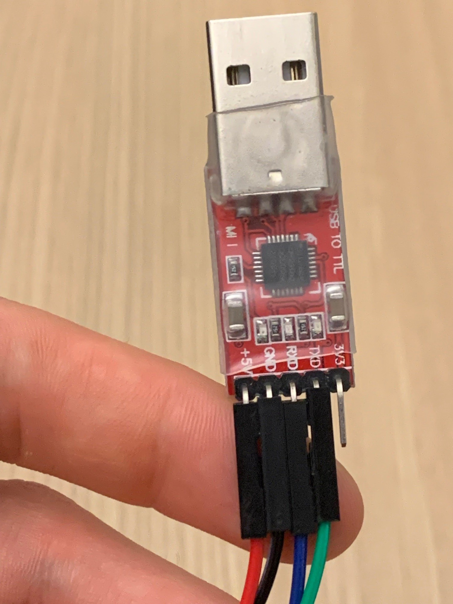

- Locate the UART0/J97 header and attach Blue to the pin labeled TX0 and Green to the pin labeled RX0. Remember, Blue is RX on the connector side but connects to TX here, and likewise Green is TX on the connector side but connects to RX here.
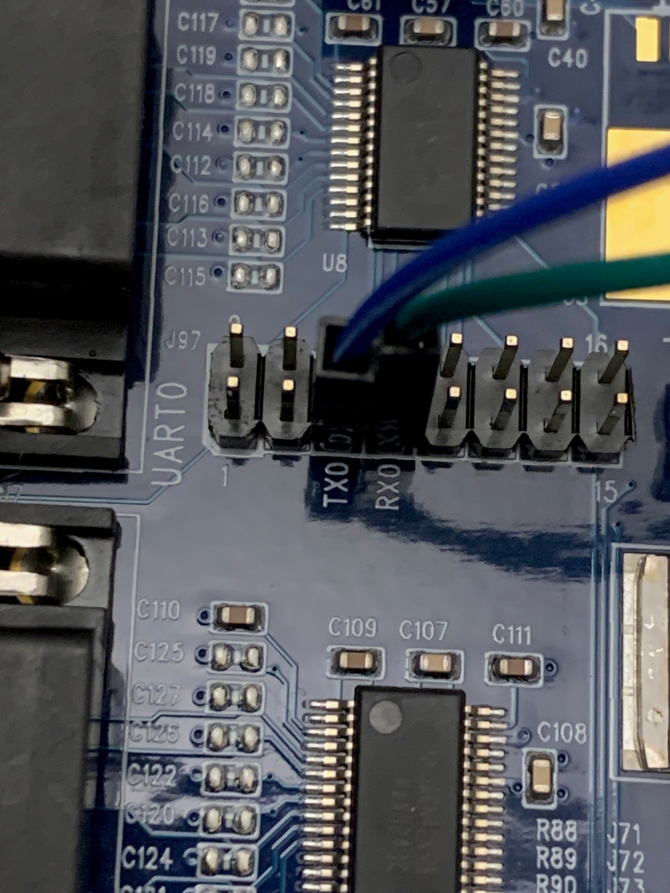

- UART0 is for host-to-EC comms, not for logs. If you want logs, you will need another USB-to-UART connector (not pictured) attached to the UART1 header.
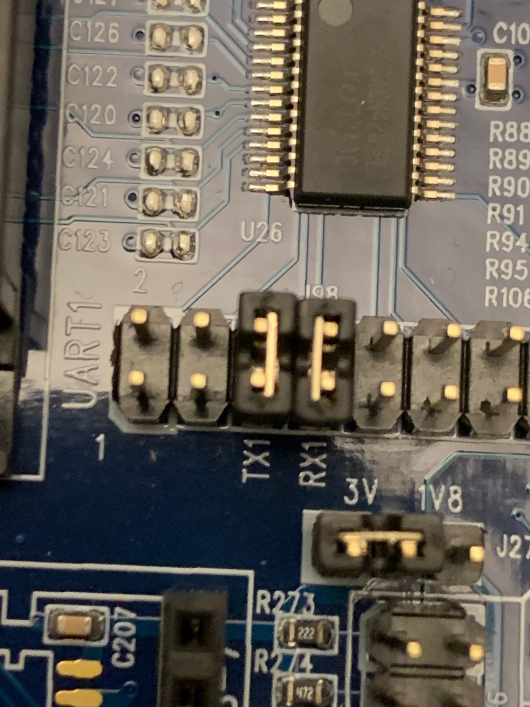

- If using my setup of powering 5V directly from the USB-to-UART connector, find J105 and remove one of the jumpers and just attach 5V (Red) to 5VSB (or 5V if one jumper is still attached). Then connect GND (Black) to the GND pin. If using an actual power source, then skip this step (just make sure the debug board, host PC, and debug board all share common gnd).
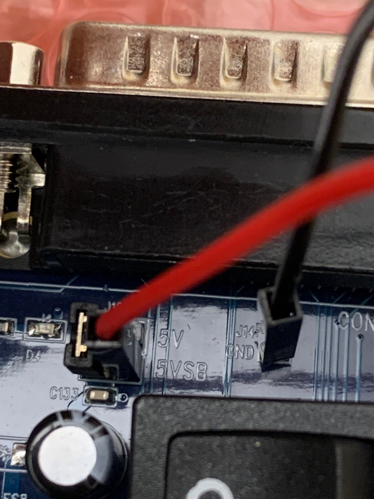

## Flashing
If everything is connected properly above, you can flash the sample.

From your `zephyrproject` folder, build it via:  
`west build -p always -b it51xxx_evb/it51526aw modules/lang/rust/samples/zephyr-odp`

Next, to flash depends on your system. Couldn't get it working directly on WSL (since the debug board always seems to die when attaching the USB to WSL), so your options are Linux or Windows (though you can just call the Windows tool from WSL to make it seamless).

For linux, download the source code for the flashing tool:  
https://www.ite.com.tw/upload/2024_01_23/6_20240123162336wu55j1Rjm4.bz2

`bunzip` it which produces a TAR (even though it's not in the filename). Extract the tar and there is a Makefile in there, so just run `make` to build the tool.

For Windows, or WSL through Windows, contact me (Kurtis Dinelle) since I had to port the Linux tool to Windows but the license forbids publishing it. The "official" winflash.exe tool is nowhere to be found online hence why I needed this port.

## Test
Get the `test-tui` from: https://github.com/OpenDevicePartnership/odp-platform-common/tree/main/ec/test-tui

Then run it with:
`cargo run --release -- --source serial <SERIAL PORT>`

And it should successfully talk to the ITE board.